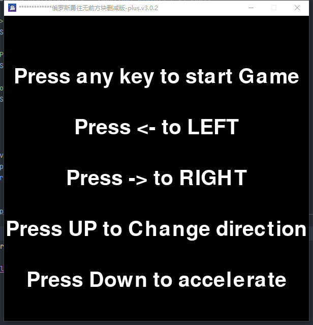
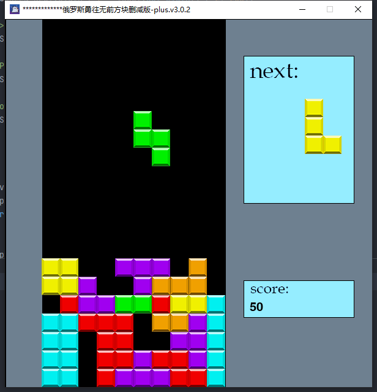

# **Tetris**

--------------------------------------
Tetris game made with the Pygame library in Python.

# Running the application

Download the Python 3 and Run the following in the terminal to install the Pygame library

> pip install pygame'

Download the source code from the repository and run the file just as any other Python script (.py) file.

> python3 main.py

# Screenshots

